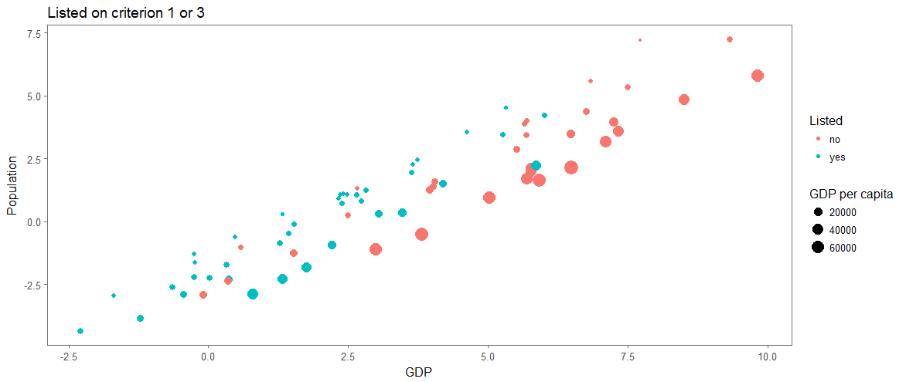
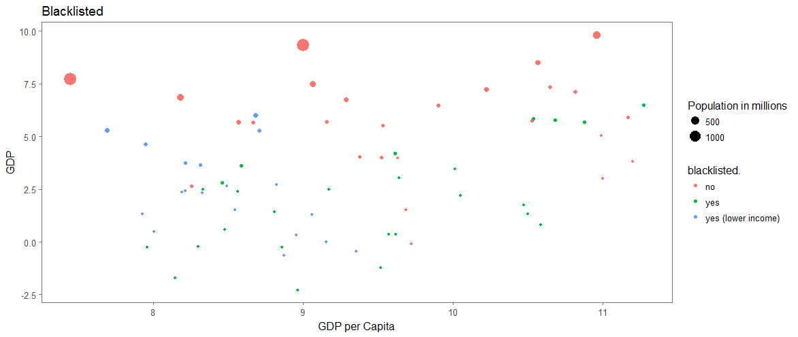

### 1. Criteria 1 and 3

The blacklist is part of a wider EU tax reform process that included the Anti-Tax Avoidance Directive (ATAD), that implemented BEPS, and the proposals for public country-by-country reporting, and was included in the action plan on corporate taxation. It is a three step process composed of a scoreboard of indicators, a screening of third countries, and a recommendation by the Commission on which countries should be added ([EU Parliament, 2017](http://www.europarl.europa.eu/legislative-train/theme-deeper-and-fairer-internal-market-with-a-strengthened-industrial-base-taxation/file-common-eu-list-of-non-cooperative-jurisdictions)).

In September 2016, the Commission released its scoreboard of indicators which makes a preliminary analysis of third country jurisdictions to determine which should receive formal further screening. The scoreboard first selects countries based on their strength of economic ties with the EU, the level of (disproportional) financial activity and stability factors (corruption and regulatory quality). Then, the countries were ranked and screened for risk indicators that included participation in tax transparency agreements, supplying preferential tax measures and having no or a very low corporate tax rate or not corporate income tax at all. This resulted in a list of 92 countries that will be screened on selected criteria (see Appendix table A2) ([European Commission, 2016](https://ec.europa.eu/taxation_customs/sites/taxation/files/2016-09-15_scoreboard-indicators.pdf)).

On first sight, it seems a promising list. It includes the usual suspects such as Switzerland and the Cayman Islands, and the EU has the audacity of screening fellow G20 members, including the USA which does not participate in the OECD Common Reporting Standard (CRS, the multilateral program for automatic exchange of information, AEoI) but does have its own, largely non-reciprocal Foreign Account Tax Compliance Act (FATCA) (Christians, 2013). However, there remains a lot of room for political interference and the rules of the first criterion seem specifically designed to ensure the US is not listed.

The three criteria are: tax transparency, fair taxation and anti-BEPS measures. We treat criteria 1 and 3 together for two reasons. First, they are similar in that they demand participation in, respectively, the OECD tax transparency initiatives and the implementation of OECD BEPS minimum standards. For criterion 3, simply pledging to implement the four BEPS minimum standards (on harmful tax practices, country-by-country reporting, treaty shopping, and dispute resolution) is enough in the short term since the peer review process is still in development. This criterion will be updated in the future to require a sufficient compliance rating by the BEPS inclusive Framework; but for now, signing up to the framework is enough to pass.

<table border="1">
  <thead>
    <tr>
      <th></th>
      <th>Criterion 1</th>
    </tr>
    </thead>
      <tr> <td align="right"> Criterion 1 </td> <td> Tax transparency </td></tr>
      <tr> <td align="right"> Criterion 1.1 </td> <td>Participate in the CRS. Future: have at least a largely compliant rating by the Global Forum on Automatic Exchange of Information</td></tr>
      <tr> <td align="right"> Criterion 1.2 </td> <td>Largely compliant rating by the Global Forum with regards to information exchange upon request</td></tr>
      <tr> <td align="right"> Criterion 1.3 </td> <td>Participate in MCMAA or have sufficient treaty network</td></tr>
      <tr> <td align="right"> Future criterion 1.4 </td> <td><em>Criterion on Beneficial ownership registers</em></td></tr>
      <thead>
        <tr>
          <th></th>
          <th>Criterion 3</th>
        </tr>
        </thead>
        <tr> <td align="right"> Anti-BEPS measures </td> <td>Commit to implement BEPS minimum standards</td></tr>
        <tr> <td align="right"> Future criterion</td> <td><em>Dependent on BEPS implementation peer review ratings</em></td></tr>

</table>

Criterion 1 is subdivided into three sub-criteria. The first is about commitment to the Common Reporting Standard AEoI program. At this point, having committed to implementation and having started the legislative process is enough to pass. In the future, the compliance rating the Global Forum - an organisation based at the OECD, but separate from it and with a wider membership, responsible for the peer reviews for the CRS – will be factored in. The second sub-criterion entails that a jurisdiction should possess at least a ‘largely compliant’ rating by the Global Forum with respect to the OECD Exchange of information on Request (EIoR) standard. The third sub criterion demands that jurisdictions either participate in the Multilateral convention on Mutual Administrative Assistance in Tax Matters – which is a multilateral convention on information exchange on request – or have a network of exchange agreements that is sufficiently broad to cover all EU member states. In the future, a fourth criterion regarding beneficial ownership will be included (Council of the European Union, 2016).

The first question that should be posed is: does the United States pass or fail the criterion on tax transparency? Not only is the United States the EU’s largest trading partner both in terms of foreign direct Investment ([Hakelberg, 2016](http://doi.org/10.1080/09692290.2015.1127269)) and trade in goods and services ([Eurostat, 2015](http://ec.europa.eu/eurostat/statistics-explained/index.php/USA-EU_-_international_trade_and_investment_statistics)), but some of its states - Delaware most famously, but many others including Nevada and Wyoming - compete to provide financial secrecy, and the USA is ranked third in the Financial Secrecy Index ([Tax Justice Network, 2015](http://www.financialsecrecyindex.com)). The US also does not participate in the OECD CRS. Instead, it has its own FATCA AEoI law, which came first. FATCA was enacted in 2010, and has a sanction mechanism. Banks that don’t share bank account information on US citizens with the US tax authorities face a 30% withholding tax on all bank transactions within the US. Because of the centrality of the dollar in the international banking system ([Emmenegger, 2015](http://doi.org/10.1515/bap-2014-0046)), this means that there is very little chance of escaping FATCA.

However, the problem of FATCA is reciprocity. Although the US signed FATCA intergovernmental agreements with several countries ([United States Treasury Department, 2017](http://www.treasury.gov/resource-center/tax-policy/treaties/Pages/FATCA.aspx)), mainly to circumvent problems with national legislation such as Switzerland’s banking secrecy laws breaches being criminal offences; the reciprocity clauses are very ambiguous about the US’s actual commitments (Christians, 2013). Indeed, the Obama administration proposed FATCA reciprocity measures in its budget proposals four years in a row, only to be turned down by Congress. There are no signals that the Trump administration will do anything to correct this imbalance.

From the EU’s perspective, this means that the US is basically the largest offshore centre that still does not automatically share information with the member states. Empirical evidence shows that there has been a significant rise in foreign bank deposits inflows in the United States, and that this is attributable to FATCA ([Hakelberg & Schaub, 2017](http://doi.org/10.1111/rego.12156)). A significant part of these foreign bank deposits are likely to be held by European Union citizens. There is a case to be made that the EU should blacklist the US, based on the deficiencies in FATCA, and its refusal to sign up to the CRS.

However, the wording in criterion 1 seems to be deliberately phrased in such a way that the US will never be on the list. Firstly, until 2019 an exception applies that a country passes criterion 1 if it fulfils two of the three sub criteria. This leaves the US safely off the list until then, since it fulfils criteria 1.2 and 1.3. Thereafter, it should fulfil all three criteria, but the first criterion changes to a peer review rating by the Global Forum on AEoI. This puts the decision out of the hands of the EU and into that of the OECD and the Global Forum. There is little reason to believe that the OECD would allow a member as important as the US be diplomatically shamed by giving it a non-compliant rating. The wording also refers to AEoI in general and not to the CRS specifically. The OECD also has a habit of including the US and FATCA in a footnote to explain its absence from lists such as the AEoI status of commitments (OECD, 2016). There is good reason to believe it will grant the US the threshold “largely compliant” rating or higher because of FATCA and that the US will not be listed in the future as well.

The countries that are listed based on a failure on either criterion 1 or 3 are generally, as shown in figure 1, lowly populated countries with a low GDP. Figure 2 shows that there is no relationship between GDP per capita of a country and being listed, and that GDP is the factor that is correlated with being put on the list. There are a few interpretations possible. One is that the OECD and the G20 managed to get the biggest economies that pose a risk of acting as offshore centres to comply with the new standards, which is a good thing.

An alternative explanation is that developing countries are being excluded from the OECD projects. The CRS for example has been criticised for denying developing countries the benefits by requiring reciprocity. Many developing countries don’t have the infrastructure to implement the CRS immediately (Eurodad, 2015). A transition period could have helped them. However, as it stands now, these countries might be listed not for refusal to sign up but merely for not having the resources to implement the needed infrastructure. All while they would arguably get the biggest marginal benefits by receiving automatic information on their own citizens. At the same time, criterion 3 compels developing countries to sign up to and implement changes to the international tax system in which they had little to say. Moreover, BEPS is based on the OECD-designed international tax rules and treaty network which are criticised for disadvantaging developing countries. Even to such an extent that the IMF cautioned developing countries to be very careful against signing such tax treaties ([IMF, 2014](http://www.imf.org/external/np/pp/eng/2014/050914.pdf)).

As it stands now, the EU’s blacklist criteria 1 & 3 will exacerbate these injustices in global taxation, instead of ameliorating them. For that reason, we differentiate between two groups of jurisdictions: high-income countries, financial centres and upper middle-income countries that are members of the G20, OECD or EU member candidates; and low & lower-middle income countries, plus other upper-middle income countries. While we fully agree the first group should be listed for failure to comply, we put in question the fairness of listing the second group for failure on these criteria alone.

<em>Figure 1: Jurisdictions listed on Criterion 1 or 3, by log GDP and log Population</em>

{: text-align: center; .fullwidth.image}

<em>Figure 2- Jurisdictions listed on Criterion 1 or 3 by log GDP per Capita and log GDP</em>

{: text-align: center; .fullwidth.image}
