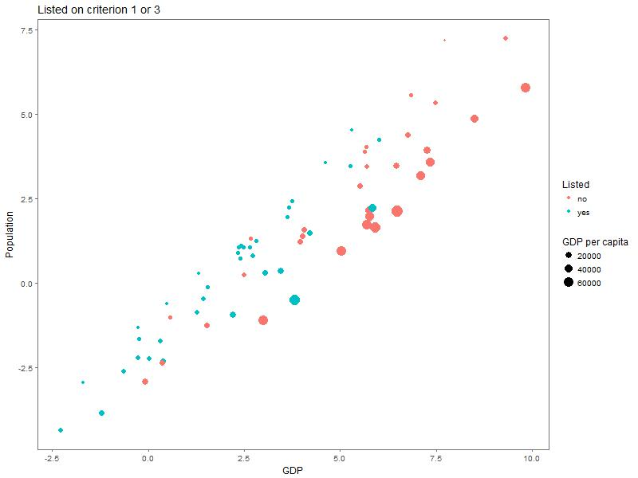
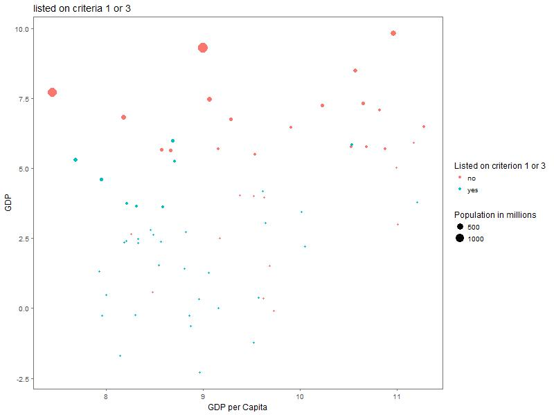

### 2. Criterion 2 - Fair taxation  

Criterion two on fair taxation contains two sub-criteria. The first is that countries should have no preferential tax measures that could be regarded as harmful. This is specified as: third country jurisdictions should not have preferential tax measures that go against the EU Code of Conduct on Business Taxation (1997). The second sub-criterion is that the jurisdiction should not facilitate offshore structures or arrangements aimed at attracting profits which do not reflect real economic activity in the jurisdiction (Council of the European Union, 2016).

Both these criterions are problematic for several reasons. In only a few cases, it’s possible to design objectively verifiable assessments of the elements set out in the Code of Conduct, one example being: “Whether advantages are accorded only to non-residents or in respect of transactions carried out with non-residents”. Assessing these however would mean to assess - in theory at least - every tax measure of every jurisdiction. One would need enormous amounts of time and resources to do this, and the authors are not sure even the Code of Conduct group itself has these.

Other elements of the code of conduct are even harder to assess, because only subjective assessments can be made and objectively verifiable parameters are not possible. For example: element 3, ‘Whether advantages are granted even without any real economic activity and substantial economic presence within the Member State offering such tax advantages’ – who defines ‘real’ and ‘substantial’, and how? The subjectivity of making this assessment would mean that the Code of Conduct on Business Taxation Group could very well come to other criteria and thus diverging outcomes than the authors.

Criterion 2.2 is even more problematic to assess because the council makes it clear that the assessment will depend on information not available to other parties such as ourselves: ‘A jurisdiction should be deemed as non-compliant with criterion 2.2 if it refuses to engage in a meaningful dialogue or does not provide the information or explanations that the Code of Conduct Group may reasonably require or otherwise does not cooperate with the Code of Conduct Group where it needs to ascertain compliance of that jurisdiction with criterion 2.2 in the conduct of the screening process.’ This gives the (infamously opaque) Code of Conduct group the authority to assess whether a jurisdiction is compliant with this criterion without public accountability. Finally, while some of the potential indicators could be obtained from public or paid sources, such as the IBFD’s databases, in many cases sources of data containing the necessary level of detail and/or specificity of assessment implied by the criteria simply do not exist.

This obliges researchers to use proxy measurements to assess whether a jurisdiction is compliant with the fair taxation criterion according to the EU. There is a strong case to be made that the ultimate aim of this part of the blacklist is to establish whether or not a jurisdiction is practicing ‘fair taxation’ in respect of attempts to attract profits associated with real economic activity located elsewhere. Not coincidentally, this aligns powerfully with the single aim of the OECD BEPS process: to reduce the misalignment of profits and real activity.

One could attempt to construct such a proxy measure by examining jurisdictions economic indicators and identifying excesses in relation to the country’s economic size. One such approach is Jan Fichtner’s Offshore-intensity ratio which looks at stock data on international banking assets, portfolio investment and foreign direct investment in relation to GDP (Fichtner, 2015). The problem with such approaches is that even that quite general economic data is not always available for some of the jurisdictions on the EU’s list. Furthermore, aggregated national statistics are often subject to political preferences and influence (Garcia-Bernardo, Fichtner, Takes, & Heemskerk, 2017).

Instead of using an indicator-based identification approach, we used the novel approach of identifying offshore financial centres (OFC’s) based on a country’s position in the network of global corporate ownership. This approach was developed by CORPNET and provides a credible, objective assessment – with sufficient global coverage – of the extent to which individual jurisdictions attract ‘excess’ profits. The researchers differentiate between OFC ‘conduits’ and ‘sinks’, which they define as follows:

INDENT FOLLOWING TWO PARAGRAPHS

*Sink-OFCs are countries that attract and retain foreign capital–territories in this category are usually characterised as tax havens, such as the British Virgin Islands, the Cayman Islands and Bermuda. Most sink-OFCs have small domestic economies and large values of foreign assets, which are attracted through low or zero corporate taxes. Because of this disparity between the local economy and external assets, the aforementioned offshore-intensity ratio approach is well suited for identifying these sink-OFCs. Conduit-OFCs on the other hand are ‘countries that are widely perceived as attractive intermediate destinations in the routing of investments’.*

*Conduit-OFCs typically have low or zero taxes imposed on the transfer of capital to other countries, either via interest payments, royalties, dividends or profit repatriation. In addition, such jurisdictions have highly developed legal systems that are able to cater to the needs of multinational corporations. Conduits play a key role in the global corporate ownership network by allowing the transfer of capital without taxation. In this way, profit from one country can be re-invested in another part of the world paying no or little taxes.*
                                          -	(Garcia-Bernardo et al., 2017)

Since we believed that just attracting excess capital flows was not enough to be blacklisted and that a jurisdiction would have to have policies deliberately targeted at attracting these, we combined the CORPNET analysis with an extra condition. The jurisdictions either has to have no or a zero percent withholding tax on dividends (data from Deloitte), or a preferential tax regime (as identified by the EU commission). When these conditions are met, the jurisdiction is deemed uncompliant with the fair taxation criterion.

We deliberately did not include the corporate tax rate in our assessment, although a low or zero percent corporate tax rate is often seen as a quintessential feature of an offshore jurisdiction.  We believe however this might exclude some jurisdictions who have a high nominal corporate tax rate, but where the effective tariff might be substantially lower. Saint Vincent and the Grenadines has a tax rate in the top 25 percent of the world bracket, but attracts as much excess capital as Hong Kong which sits at the bottom 25 percent.

We also include three extra indicators per jurisdictions, whether it has transfer pricing rules in place, thin capitalisation rules and controlled foreign company rules. The absence of such rules are major factors in the profit-shifting potential of a certain country. This might give the EU commission a starting point for recommendations to the listed jurisdictions.

The following plots (figure 3 & 4) show how the inclusion of criterion 2 changes which countries are captured by the blacklist. The figures show that, while a couple more countries are listed, the pattern does not change. High-GDP countries tend to escape while lower-GDP countries are blacklisted. Again, GDP per capita shows no correlation to being blacklisted or not. This again has the ambiguous meaning that the OECD and G20 have managed to include most important financial centres in the CRS and BEPS, but that developing countries tend to be left out of these important initiatives in an area where they could use assistance from developed countries.

{: .image}

{: .image}
