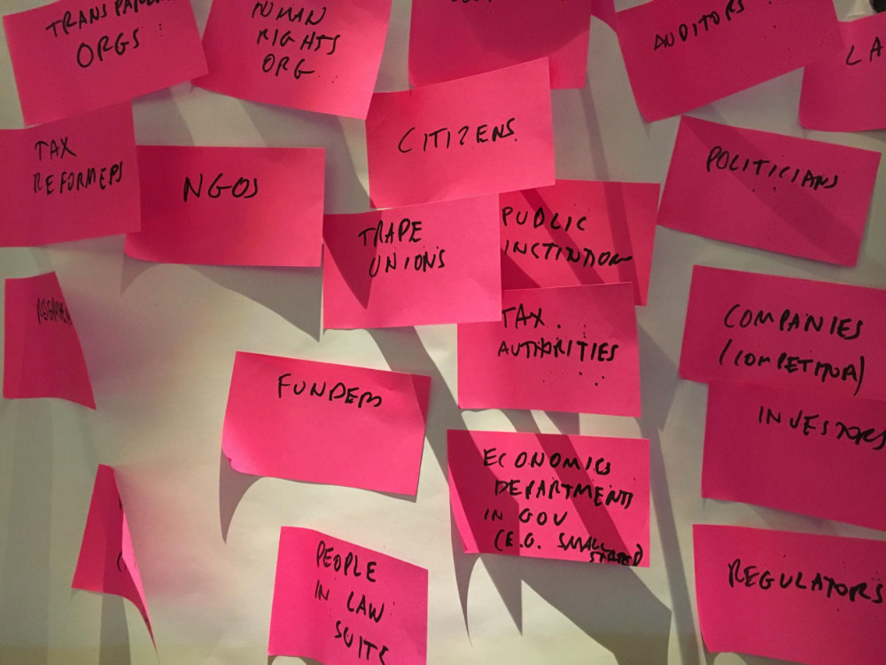

### 1. Who Would Use A Public Database and How?

{: .image}

In this section we look at the envisaged publics of a public database. Reports suggest that "a properly designed country-by-country reporting regime would be a much needed weapon for tax authorities which at present suffer from information asymmetry in the tax avoidance battle with MNEs" (Ting, 2014). But while the OECD proposals mainly focus on facilitating automatic information exchange between tax authorities, we are interested in who else could use and benefit from having access to a more comprehensive picture of the tax contributions and economic activities of multinational companies, beyond tax authorities, audit firms and the multinationals themselves.

A public database would represent a shift beyond a narrow conception of accounting for the activities of multinationals as a niche activity for professional specialists, and towards a vision which sees a broader range of actors involved in witnessing the tax arrangements of multinationals and engaging in a range of activities to hold them to account.

In order to better understand the prospective users and scenarios of use of a public database, we solicited for input in the form of "user stories" from a network of people and organisations associated with the Open Data for Tax Justice initiative. User stories are widely used as a technique to gather user requirements for agile software development (Cohn, 2004). They are often written in the form “As a [user], I need/want/expect to [need], so that [motivation]”.

An initial set of user stories were created by a group at a participatory design workshop in Oxford in October 2016, and refined and developed with further input received online in response to a public call and outreach to prospective users. These user stories, questions and analytical requirements are intended to serve as input to subsequent design and development activities, and to evaluate the opportunities and limitations of a database assembled through the repurposing of existing sources of public information. We are reproducing them below in order to illustrate the range of envisaged publics and interests around a future database.
